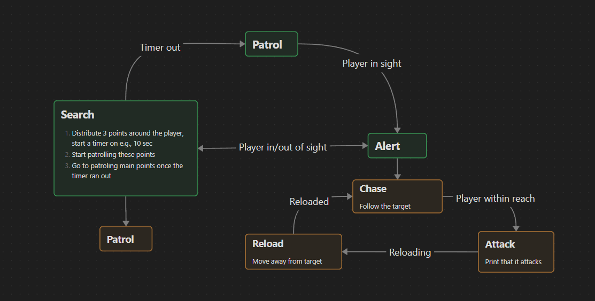

## Overview
Implementation of steering behaviors for autonomous agents, progressing from basic behaviors to flocking, optimized with spatial partitioning.
Now also includes A* pathfinding based on nav mesh.

## Extra assignment - Hierarchical state machine(week 7)
Thief is controlled by clicking LMB on the map\
Guard is controlled by the following state machine:

## Flocking

### Basic Steering Behaviors
- **Seek/Flee** - Move towards/away from target
- **Arrival** - Smooth deceleration
- **Wander** - Random steering
- **Pursuit/Evasion** - Predict target movement

### Blended Behaviors
- Weighted combination of multiple behaviors
- Priority-based steering

### Flocking
- **Separation** - Avoid crowding neighbors
- **Velocity match** - Match neighbor heading
- **Cohesion** - Move toward group center

### Spatial Partitioning
Grid-based optimization for more efficient neighbor detection

## A*
### BFS
One of the simplest approaches to pathfinding. Straightforward to implement, but not very efficient.
### Grid-based A*
Finds the shortest route between two points on a grid. The algorithm seems optimal for the context, but
grids are not effecient for maps with inconsistent detail density(e.g., open world).
### Nav mesh-based A* with SSFA
The same algorithm as above, but smoothed out using Stupid Simple Funnel Algorithm.
